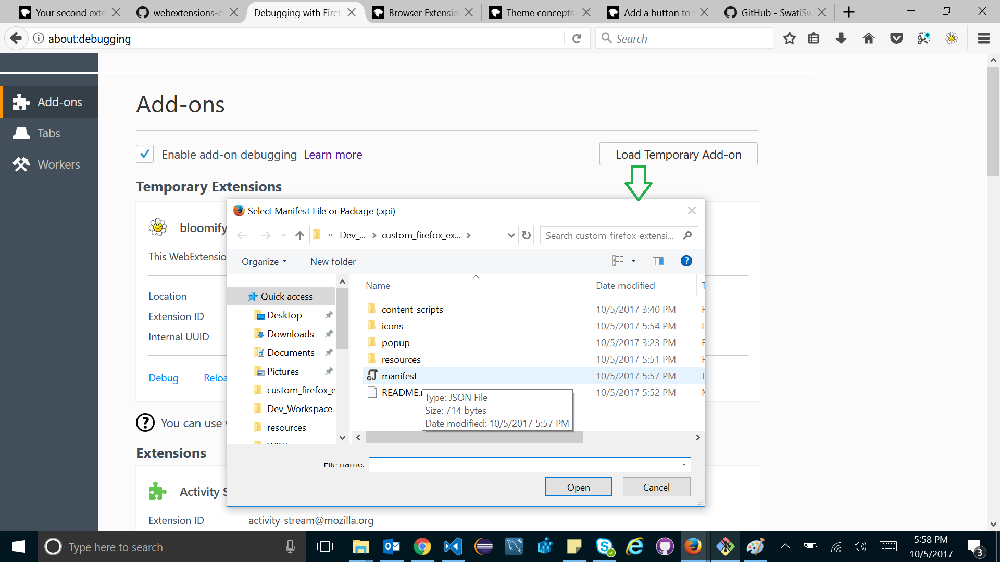

# BLOOMIFY
---

This add-on injects JavaScript into web pages. The addons.mozilla.org domain disallows this operation, so this add-on will not work properly when it's run on pages in the addons.mozilla.org domain.
What it does

The extension includes:

   * a browser action with a popup including HTML, CSS, and JS
   * a content script
   * five images, each of a different flower, packaged as web accessible resources

When the user clicks the browser action button, the popup is shown, enabling the user to choose one of five flower.

When they choose a flower, the extension injects the content script into the current page, and sends the content script a message containing the name of the choosen flower.

When the content script receives this message, it replaces the current page content with an image of the choosen flower.

When the user clicks the reset button, the page reloads, and reverts to its original form.

**What it shows**

   * write a browser action with a popup
   * give the popup style and behavior using CSS and JS
   * inject a content script programmatically using tabs.executeScript()
   * send a message from the main extension to a content script
   * use web accessible resources to enable web pages to load packaged content
   * reload web pages

## How to get started?
---
Clone the repository or download the zipped folder.

Install web-ext
web-ext is a node-based application that you can install with the nodejs/npm tool. Install web-ext using the following command:

`npm install --global web-ext`

Testing out the extension

You can test the extension in Firefox by cd'ing into your extension's(downloaded source code) root directory and entering the following command:

`web-ext run`

# Alternate way

Open "about:debugging" in Firefox, click "Load Temporary Add-on", and select your manifest.json file from the extension root directory. You should then see the extension's icon appear in the Firefox toolbar:

